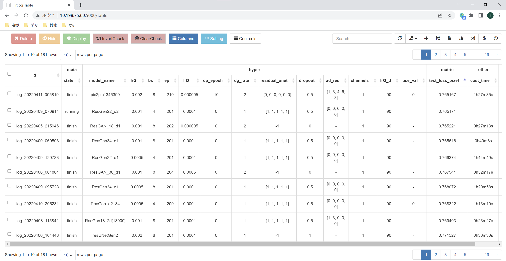

## Running Approach

**Approach 1 (Recommended): Use jupyter notebook**

 

Open with notebook: mldesign.ipynb.

We have placed the parameters of 6 typical models obtained from the experiment in this notebook. Additionally, at the beginning of the notebook, there are a few third-party libraries that may need to be installed.


**Approach 2:**

 

step1: Set up the environment. On top of existing PyTorch, you will also need to install two packages:

 

```bash
#Print progress bar

pip install progressbar2 

#Used for logging

pip install fitlog 

fitlog init
```

 

step2: Run

```bash
python my_train.py
```


**Possible Issues**

 

Some OS might not be able to use fitlog, please use the parameter

```bash
python my_train.py --if_fitlog -1
```

 

### Visualization of Results

 

We have placed the generated images in *./output/*, and named the folders according to the hyperparameters you selected.

 

Additionally, execute

```bash
fitlog log logs
```


Fitlog will occupy a network interface on your machine (default is 5000), then you can access all your previous running logs through this interface, as shown in the image below:

 



 

 


 

### Hyperparameter List

We have integrated 8 types of models into one interface, you only need to modify the `--model_name` parameter to train and test different models.

 

Valid model names **must include** one of the following characters:

 

```python
valid_model_name = ['AutoEncoderGen', 'UNetGen', 'ResGen', 'UResGen', 'GAN', 'pic2pic', 'ResGAN', 'UResGAN']
```

 

You can add comments to these names (e.g., ResGen_18).

In addition, we offer a wealth of adjustable parameters. Besides common hyperparameters like learning rate and batch size, you can even modify the way network layers are connected or insert any number of res blocks within the network; moreover, you can control whether to save the model after training ends, and whether testing/training are separated.

We have also printed the model architecture in *output/<model_name>/<opt>/<model_name>.txt* for you to check the model structure.

 

Input: `python my_train.py -h`

```bash
usage: my_train.py [-h] [--model_mode MODEL_MODE] [--model_name MODEL_NAME] [--dropout DROPOUT] [--channels CHANNELS]

​          [--n_block N_BLOCK] [--ad_res AD_RES] [--n_downsampling N_DOWNSAMPLING] [--crop_weight CROP_WEIGHT]     

​          [--discriminator DISCRIMINATOR] [--residual_unet RESIDUAL_UNET] [--use_val USE_VAL] [--lrG LRG] [--lrD LRD]

​          [--bs BS] [--ep EP] [--dg_rate DG_RATE] [--dp_epoch DP_EPOCH] [--lrG_d LRG_D] [--lrD_d LRD_D]

​          [--g_loss_func G_LOSS_FUNC] [--d_loss_func D_LOSS_FUNC] [--b1 B1] [--b2 B2] [--weight_pic WEIGHT_PIC]    

​          [--epoch EPOCH] [--n_cpu N_CPU] [--img_height IMG_HEIGHT] [--img_width IMG_WIDTH]

​          [--sample_interval SAMPLE_INTERVAL] [--if_remove IF_REMOVE] [--data_path DATA_PATH]

​          [--checkpoint_interval CHECKPOINT_INTERVAL] [--if_fitlog IF_FITLOG] [--if_test IF_TEST]

​          [--model_dir MODEL_DIR] [--dataloader_length DATALOADER_LENGTH] [--if_save IF_SAVE]

 

optional arguments:

 -h, --help       show this help message and exit

 --model_mode MODEL_MODE

​            Set model to training or testing mode

 --model_name MODEL_NAME

​            Model name

 --dropout DROPOUT   Whether to use dropout

 --channels CHANNELS  Number of channels, 1 or 3

 --n_block N_BLOCK   Total number of blocks after ResGenerator sampling (even number)

 --ad_res AD_RES    Number of res_blocks added per layer in up/downsampling (top-down) Up and down sampling layers are symmetrical

 --n_downsampling N_DOWNSAMPLING

​            Number of times ResGenerator downsamples

 --crop_weight CROP_WEIGHT

​            Whether skip connection stitching weight is trainable Less than zero means not trainable Greater than zero is used as initial value of crop_weight

 --discriminator DISCRIMINATOR

​            Type of discriminator

 --residual_unet RESIDUAL_UNET

​            Whether to use residual learning in the upsampling layer (top-down)

 --use_val USE_VAL   Whether to use validation set to train the generator

 --lrG LRG       adam: learning rate

 --lrD LRD       adam: learning rate

 --bs BS        size of the batches

 --ep EP        number of epochs of training

 --dg_rate DG_RATE   Discriminator iterations per Generator iteration

 --dp_epoch DP_EPOCH  Discriminator pre-training epochs

 --lrG_d LRG_D     G lr down

 --lrD_d LRD_D     D lr down

 --g_loss_func G_LOSS_FUNC

​            L1 means L1;fixed_L1 means modified L1

 --d_loss_func D_LOSS_FUNC

​            Discriminator loss function

 --b1 B1        adam: decay of first order momentum of gradient

 --b2 B2        adam: decay of first order momentum of gradient

 --weight_pic WEIGHT_PIC

​            Ratio of pic_loss in calculating generator loss

 --epoch EPOCH     epoch to start training from

 --n_cpu N_CPU     number of cpu threads to use during batch generation

 --img_height IMG_HEIGHT

​            size of image height

 --img_width IMG_WIDTH

​            size of image width

 --sample_interval SAMPLE_INTERVAL

​            interval between sampling of images from generators

 --if_remove IF_REMOVE

​            Whether to remove the model

 --data_path DATA_PATH

​            Dataset location

 --checkpoint_interval CHECKPOINT_INTERVAL

​            interval between model checkpoints

 --if_fitlog IF_FITLOG

​            Whether to use fitlog

 --if_test IF_TEST   Whether to test after model execution. If 0, test during model training

 --model_dir MODEL_DIR

​            Model folder

 --dataloader_length DATALOADER_LENGTH

​            Dataset length, needed to calculate steps

 --if_save IF_SAVE   Whether to store the model 1 means store all;-1 means only store the last model;0 means do not store
```

## Best Results:
### Original AutoEncoder


### Original pix2pix


### Original GAN


### Best Single Generator


### Best pix2pix


### Best GAN Test


